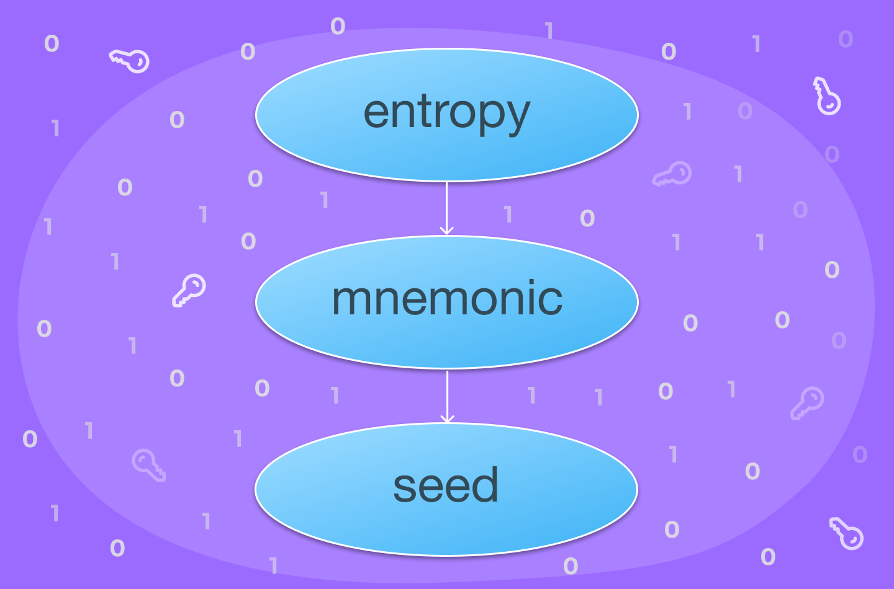
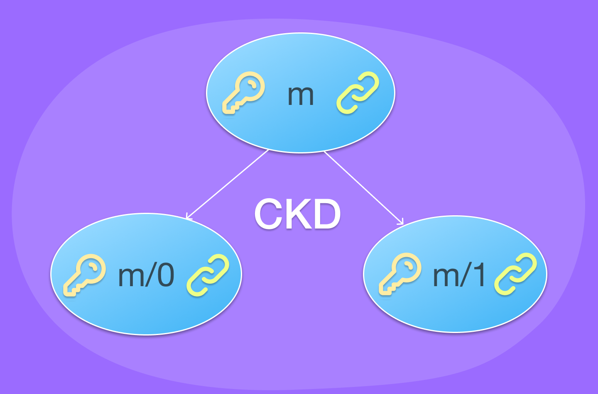

# bips
Bitcoin Improvement Proposals implemented in Clojure.

BIP39
=====

Generate 12-25 words mnemonic seed from random 128-512 bits of random data
and 512 bits seed from the mnemonic seed.



Examples
--------

Code snippet demonstrating the generation of a mnemonic phrase from
the input entropy, which is a sequence of bytes obtained by converting
the hexadecimal string "000102030405060708090a0b0c0d0e0f" into a
sequence of bytes.

```clojure
(entropy->mnemonic (codecs/hex->bytes "000102030405060708090a0b0c0d0e0f"))
;; => "abandon amount liar amount expire adjust cage candy arch gather drum buyer"
```

Code snippet calling the `check-mnemonic` function with a mnemonic
phrase as its argument and the function is returning a boolean value
indicating whether the input mnemonic phrase is valid or not. In this
particular case, the function is returning true, indicating that the
mnemonic phrase is valid.

```clojure
(check-mnemonic "abandon amount liar amount expire adjust cage candy arch gather drum buyer")
;; => true
```

The following example code is calling the `mnemonic->seed` function
with a mnemonic phrase as its argument and the function is returning a
hexadecimal string representing a 512 bits binary seed generated from
the input mnemonic phrase.

```clojure
(mnemonic->seed "abandon amount liar amount expire adjust cage candy arch gather drum buyer")
;; => "3779b041fab425e9c0fd55846b2a03e9a388fb12784067bd8ebdb464c2574a05bcc7a8eb54d7b2a2c8420ff60f630722ea5132d28605dbc996c8ca7d7a8311c0"
```

Reference
---------

- https://github.com/bitcoin/bips/blob/master/bip-0039.mediawiki

BIP32
=====

BIP32 is the implementation of a Multi-Account Hierarchy for
Deterministic Wallets ie. tree structure derived from a root seed
phrase (entropy) and a hierachical set of indices.  A number of
benefits follow:

- An entire wallet can be backed up once by storing the wallet seed or
  master extended private key, and all future addresses in the wallet
  can be restored from it.
- The creation of public and private ECDSA keys may be separated from
  each other. That is, it is possible to create only the public ECDSA
  key half (and receiving address) of an ECDSA key pair, without the
  ability to create the private half. Thus, one can create receiving
  addresses on a public facing system that if compromised would not
  give the attacker the ability to spend bitcoin received at those
  addresses. A separate, offline machine can generate the
  corresponding private ECDSA keys and sign transactions.
- Public and private ECDSA keys may be created in a hierarchy, and
  control over or visibility of portions of the hierarchy may be
  delegated to third parties. This has uses for auditing, for
  separating ECDSA key sequences into different logical groups or
  accounts, and for giving 3rd parties the ability to create spending
  transactions without first getting a receiving address in advance.



Examples
--------

The following code snippet generates the master node (i.e., root of
the HD wallet tree) from an hexadecimal encoded 512 bits BIP 39 binary
seed.

```clojure
(derive-master-node "3779b041fab425e9c0fd55846b2a03e9a388fb12784067bd8ebdb464c2574a05bcc7a8eb54d7b2a2c8420ff60f630722ea5132d28605dbc996c8ca7d7a8311c0")
;; => {:private-key
;;     "c95cfacbafcd5f00187eac74a10f48e8a77d2efe477ae6cb84322ffb28546352",
;;     :public-key
;;     "0392030131e97b2a396691a7c1d91f6b5541649b75bda14d056797ab3cadcaf2f5",
;;     :chain-code
;;     "2f891b55b105d8c24e6f267c666ba55b7994aa14214c5aedad4b694eb7fd2d49",
;;     :depth 0}
```

The following code snippet generates a private child key from a
private parent key. In this case, the parent key is the master node
obtained in the preceding example.

```clojure
(CKDpriv {:private-key
 "c95cfacbafcd5f00187eac74a10f48e8a77d2efe477ae6cb84322ffb28546352",
 :public-key
 "0392030131e97b2a396691a7c1d91f6b5541649b75bda14d056797ab3cadcaf2f5",
 :chain-code
 "2f891b55b105d8c24e6f267c666ba55b7994aa14214c5aedad4b694eb7fd2d49",
 :depth 0} 0)
;; => {:private-key
;;     "47f737c97d068f75aee135e677f2cd3e06fcf03620a211962eac715289653902",
;;     :chain-code
;;     "e20e803729e1db26fb87defdc50f07242727ad74c8765b18901493ce528d44ae",
;;     :index 0,
;;     :depth 1}
```

The following code snippet uses `CKDpub` function for generating a
public child key from a public parent key. In this case, the public
parent key is the neutered master node (without the private key part).

```clojure
(CKDpub {:private-key
 "c95cfacbafcd5f00187eac74a10f48e8a77d2efe477ae6cb84322ffb28546352",
 :public-key
 "0392030131e97b2a396691a7c1d91f6b5541649b75bda14d056797ab3cadcaf2f5",
 :chain-code
 "2f891b55b105d8c24e6f267c666ba55b7994aa14214c5aedad4b694eb7fd2d49",
 :depth 0} 0)
;; => {:public-key
;;     "03d8bb162ef993171627788a4aba3adb0a149172eded1a519c62b27ea58e0e9613",
;;     :chain-code
;;     "e20e803729e1db26fb87defdc50f07242727ad74c8765b18901493ce528d44ae",
;;     :index 0,
;;     :depth 1}
```

In the following example code, `N` returns the neuteured version of a
node by removing the private key part.

```clojure
(N {:private-key
 "47f737c97d068f75aee135e677f2cd3e06fcf03620a211962eac715289653902",
 :chain-code
 "e20e803729e1db26fb87defdc50f07242727ad74c8765b18901493ce528d44ae",
 :index 0,
 :depth 1})
;; => {:public-key
;;     "03d8bb162ef993171627788a4aba3adb0a149172eded1a519c62b27ea58e0e9613",
;;     :chain-code
;;     "e20e803729e1db26fb87defdc50f07242727ad74c8765b18901493ce528d44ae",
;;     :index 0,
;;     :depth 1}
```

In the following code snippet, the `derive-path` function will
generate a child node at the path "m/0H/1/2H/2/1000000000" from the
parent node derived from the seed "000102030405060708090a0b0c0d0e0f".

The `derive-path` function is used to derive a child node at a
specific path from a parent node (which is derived from the seed). It
does this by iteratively calling the `CKDpriv` function to derive each
child node in the path from its parent node.  The path string
specifies the path to the desired child node, using the format
"m/<index1>/<index2>/.../<indexN>", where each index is an integer
representing the child index. An index may be followed by the letter
"H" to indicate that it is a hardened child index (i.e., it is greater
than or equal to 2^31).

The keyword `:private` indicates that the private key of the child
node should be included in the returned map. If the keyword `:public`
is used instead, the private key will be omitted from the returned
map.


```clojure
(derive-path "000102030405060708090a0b0c0d0e0f" "m/0H/1/2H/2/1000000000" :private)
;; => {:private-key
;;     "471b76e389e528d6de6d816857e012c5455051cad6660850e58372a6c3e6e7c8",
;;     :chain-code
;;     "c783e67b921d2beb8f6b389cc646d7263b4145701dadd2161548a8b078e65e9e",
;;     :index 1000000000,
;;     :depth 5}
```

The code below is the macro-expanded version of the code snippet from
version v0.1.1. It no longer expands to this form, but it will be kept
here for better visualization since it's pretty much what happens with
`derive-path` function:

```clojure
(CKDpriv
  (CKDpriv
    (CKDpriv
      (CKDpriv
        (CKDpriv
          (derive-master-node "000102030405060708090a0b0c0d0e0f")
          2147483648)
        1)
      2147483650)
    2)
  1000000000)
```

Reference
---------

- https://github.com/bitcoin/bips/blob/master/bip-0032.mediawiki

BIP44
=====

This proposal defines a logical hierarchy for deterministic wallets
based on an algorithm described in BIP-0032.

Example
-------

The example below generates a BIP 44 derivation path for a specific
key within an HD wallet.

The first argument, "BTC", specifies the coin type. In this case,
"BTC" stands for Bitcoin. The second argument, 0, specifies the
account index. The third argument, :external, specifies the type of
derivation. :external specifies that the derivation path should be for
the external chain, which is used for receiving payments. The final
argument, 0, specifies the address index within the external chain.

The resulting output of the function is the string "m/44'/0'/0'/0/0",
which is a BIP 44 derivation path. The m at the beginning of the
string stands for "master", and the subsequent numbers and single
quotes (') represent child derivation steps. The 44' specifies that
the key being derived is a hardened key at the 44th index of the BIP
44 purpose field. The subsequent numbers 0'/0'/0/0 specify the account
index, external chain index, and address index, respectively. The
single quotes indicate that the keys at these indices are hardened
keys.

In this specific example, the derivation path would represent the
first external address (address index 0) in the first account (account
index 0) of the Bitcoin coin type (coin type "BTC").

```clojure
(derivation-path "BTC" 0 :external 0)
;; => "m/44'/0'/0'/0/0"
```

A second version of `derivation-path` takes only 2 arguments a
`coin-type` and an `account` index to derive an account address.

```clojure
(derivation-path "BTC" 0)
;; => "m/44'/0'/0'"
```

Reference
---------

- https://github.com/bitcoin/bips/blob/master/bip-0044.mediawiki
